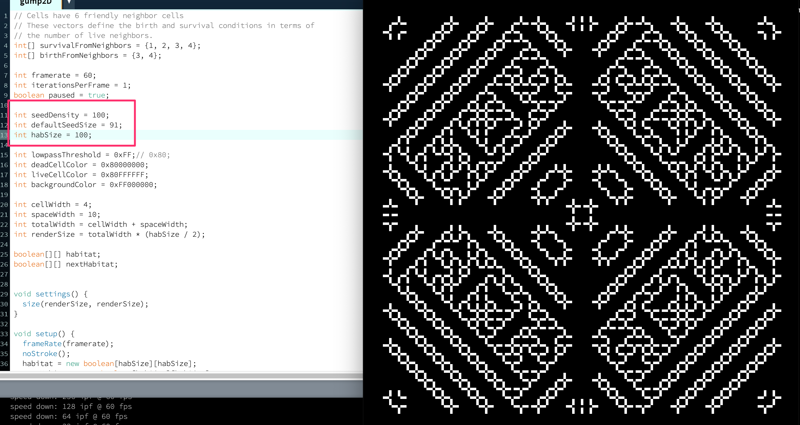

# gump2D

An outer-totalistic cellular automata in 2D, like Conway's Life, but with interstitial cells in the style of [gump](https://github.com/kdbanman/gump).

This looks pretty, but the source code is a tangled mess of copypasta.
It looks like I wrote it as an affront to software engineering principles.

Here's an example of a pattern that it can produce after a few tens of millions of generations:

